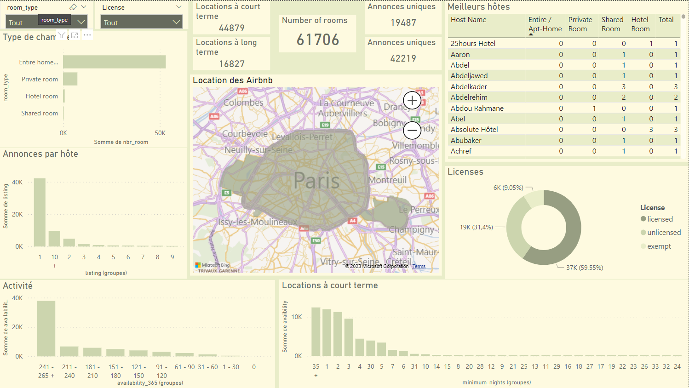

# DBT Final Project

This project 

Participants :
- [Marième Pouye](https://github.com/mariememuslima)
- [Fatou Bintou Wade](https://github.com/mariememuslima)
- [Khady Gueye](https://github.com/mariememuslima)

## Setting the DBT environment

To use DBT, you should have Python installed in your device

Install the virtual environment dependencies
``` 
pip install virtualenv
```

Create a virtual environment
``` 
python -m venv env
```
Activate the virtual environment in windows 
``` 
source .\env\Scripts\Activate.ps1
```
Activate the virtual environment on Ubuntu
``` 
source env\bin\activate
```
Upgrade pip
``` 
python -m pip install --upgrade pip
```
Install dbt-core and the dependencies for the databases used (dbt-bigquery, dbt-posgres, dbt-snowflake)
``` 
pip install dbt-core dbt-bigquery
```
Check dbt version
``` 
dbt --version
```
Initiate the dbt, this command will create the dbt file/repositories structuration, follow the instruction by giving the dbt's name project, the database informations needed etc Make sure to add the correct information 
``` 
dbt init
```
## Configuration

Initiate the dbt, this command will create the dbt file/repositories structuration, follow the instruction by giving the dbt's name project, the database informations needed etc Make sure to add the correct information 

``` 
dbt init
```
After initiating the dbt project, you should put the correct informations related to your bigquery database

## Understand the project
Our project aims to exploit data from Airbnb. Airbnb connects individuals, hotel companies, and rental property investors. It is within this context that we decided to explore the following KPIs:
* KIND OF BEDROOM
* ACTIVITY
* LICENSES
* SHORT TERM RENTAL
* ANNOUNCEMENT BY HOST
* BEST HOSTS

## Understand the KPI
### KIND OF BEDROOM :
For this KPI we determine the different types of rooms that exist on our dataset with its total number of
### ACTIVITY :
In terms of activity, we have determined them according to the availability_365 indicator
### LICENSES:
This involves determining which Airbnbs have a license or not, in addition to those which are exempt or pending.
### SHORT TERM RENTAL
This is to determine whether short-term or long-term rentals are more popular
### ANNOUNCEMENT BY HOST
For each host, we output the number of announcements that were made.
### BEST HOSTS
We determined who the best hosts are in relation to the accommodation offered
### BEST HOSTS
We add the map model to locate the airbnbs in Paris 

## Airflow Configuration

Initiate the dbt, this command will create the dbt file/repositories structuration, follow the instruction by giving the dbt's name project, the database informations needed etc Make sure to add the correct information 

1. Setting the environment

Create the airflow folder
``` 
mkdir Airflow
```
po
``` 
cd .\Airflow\
```
Create python environment
``` 
python -m  venv env
```
Enable the python environment
``` 
source .\env\Scripts\Activate
```
Upgrade pip
``` 
python -m pip install --upgrade pip
```
Install Airflow with pip
``` 
pip install "apache-airflow[celery]==2.7.0" --constraint "https://raw.githubusercontent.com/apache/airflow/constraints-2.7.0/constraints-3.8.txt"
```

Initiate Apache Airflow
``` 
airflow db init
```
You'll need to set the airflow.cfg file by filling in the core section the dags'directory path

Create an admin user 
``` 
airflow users create --username admin --firstname <YOUR_FIRST_NAME> --lastname <YOUR_LAST_NAME> --role Admin --email admin@example.com
```


2. Start Airflow 
Start Airflow webser
``` 
airflow webserver --port 8080
```
Start Airflow scheduler
``` 
airflow scheduler
```
To run it in detach mode you can do
in windows
``` 
airflow webserver --port 8080 -D
airflow scheduler -D
```
in ubuntu
``` 
airflow webserver --port 8080 &
airflow scheduler &
`````````
## Creating an Exposure with DBT

To create our exposure, we make sure to add the exposure sexion to the models/schema.yml file. By running the following command, we create a json file that make the documentation of our models 
``` 
dbt docs generate
`````````
to visualize in a webserver (on http://localhost:8080) the documentation and everything related to the work, run the following command. 
``` 
dbt docs serve
`````````

## The airflow dag scheduled
You can add the file dags/airbnb_dag.py to your airflow/dags/ repository installed withe the precedent instructions to run the dbt project everyday at **8 am** 

## Vizualisation With Power BI



We made a visualisation to  enlight our models. You can see the pbix file the visualization/ folder. 